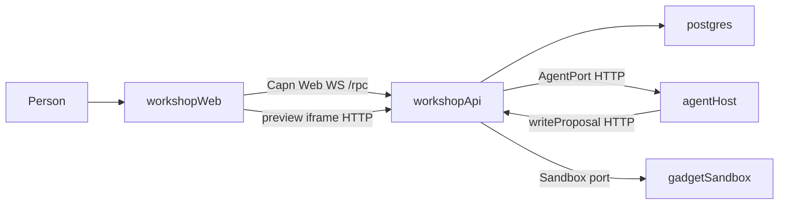
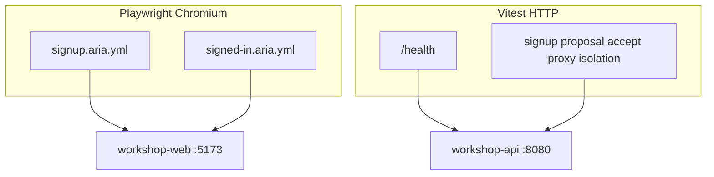
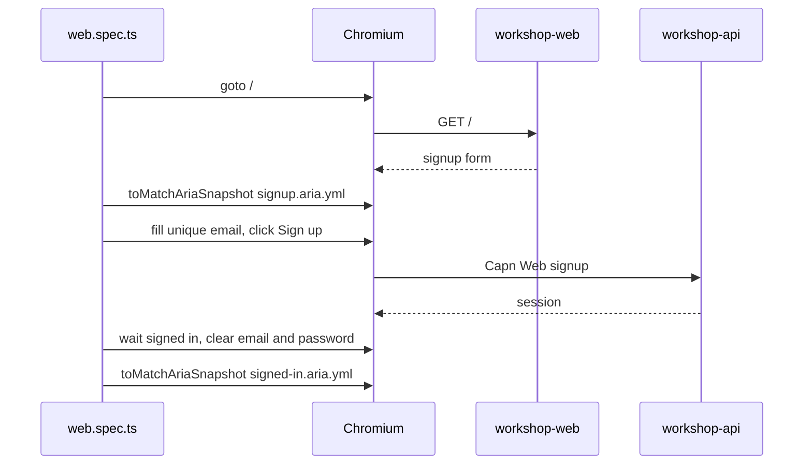

# workshop-web Aria Snapshots - Plan

Created: 2026-09-04

Lock what a person can see and operate in `workshop-web` using Playwright's accessibility-tree snapshots. Do not use pixel goldens as the default. Leave Vitest HTTP e2e as the isolation and kernel proof.

## Goal Capsule

Pin named page states of the SPA against YAML accessibility trees so a dropped Sign up control fails CI even when `/signup` still returns JSON.

Authority: Playwright Snapshot testing docs, Playwright visual comparisons warning, current compose e2e layout.

Stop when signup and signed-in goldens exist, Chromium is the only project, and `pnpm test:e2e:web` is the SPA gate. Do not add Firefox, WebKit, PNG goldens, or a `proposal-preview` state until the SPA has a stable, person-visible proposal surface.

## Product Contract

### Summary

Playwright's page titled Snapshot testing is `toMatchAriaSnapshot`. It compares a YAML accessibility tree, not pixels. Visual comparisons live on a different page and warn that rendering depends on OS, GPU, fonts, and headless mode.

`workshop-web` is an unstyled vanilla DOM. Pixel goldens would pin an empty page. Aria YAML pins heading, fields, and buttons. Unique emails must be cleared before the signed-in snapshot so the golden does not change every run.

### Problem Frame

`e2e/core-loop.test.ts` and `e2e/smoke.test.ts` are Vitest `fetch` against compose. `packages/workshop-web/src/api.test.ts` is a mocked `fetch`. None of those open a browser. If the signup form vanished and the API still returned JSON, CI would stay green.

### Requirements

- R1. A dropped Sign up, email, password, Send, Accept, or Revert control fails `pnpm test:e2e:web`.
- R2. Goldens are YAML accessibility trees stored next to `e2e/web.spec.ts`.
- R3. Chromium is the only Playwright project.
- R4. Compose Vitest HTTP e2e remains the kernel and isolation gate. Playwright does not re-prove `reachedApi === false`.
- R5. Unique signup emails are cleared before the signed-in snapshot.
- R6. CI installs Chromium only (`playwright install --with-deps chromium`) and runs `pnpm test:e2e:web` after the core loop.

### Scope Boundaries

In scope: signup and signed-in named states; Chromium; compose `baseURL` `http://127.0.0.1:5173`.

Out of scope: Firefox, WebKit, `toHaveScreenshot` PNG goldens, Vitest browser mode, screenshot artifacts with no assertion, a third `proposal-preview` state that needs the fixture agent and a stable SPA proposal surface.

### Actors

- A1. Person at the workshop SPA.
- A2. Compose stack (`workshop-web` on 5173, `workshop-api` on 8080).
- A3. CI job `core-loop` in `.github/workflows/e2e.yml`.

### Flows

F1. Signup state: open `/`, wait for heading and Sign up, match `signup.aria.yml`.

F2. Signed-in state: sign up with a unique email, wait for status `signed in` and Send, clear email and password, match `signed-in.aria.yml`.

## Planning Contract

### Key Technical Decisions

- KTD1. Use `@playwright/test` `toMatchAriaSnapshot({ name })` with `.aria.yml` files. Playwright documents this as Snapshot testing. Named files go in `e2e/web.spec.ts-snapshots/` via `expect.toMatchAriaSnapshot.pathTemplate`.
- KTD2. Do not use `toHaveScreenshot` as the first SPA gate. Playwright's visual comparisons page warns that screenshots vary by host OS, version, settings, hardware, power source, and headless mode. This SPA has almost no CSS.
- KTD3. Keep three e2e surfaces disjoint: Vitest smoke (`/health`), Vitest core-loop (HTTP product loop and isolation), Playwright aria (SPA roles and names).
- KTD4. Chromium only. Playwright CI docs recommend installing only the browsers you run.
- KTD5. Clear unique emails before the signed-in golden. Accessible names of the textboxes stay `email` and `password`; values must not leak into the tree as run-specific text.

### High-Level Technical Design

Playwright owns the person-to-SPA edge. Vitest HTTP owns api, isolation, and gadget proxy.

Named page states, not a pile of screenshot asserts:

| State     | File                                           | Pins                                       |
| --------- | ---------------------------------------------- | ------------------------------------------ |
| signup    | `e2e/web.spec.ts-snapshots/signup.aria.yml`    | heading gaos, email, password, Sign up     |
| signed-in | `e2e/web.spec.ts-snapshots/signed-in.aria.yml` | Send / Accept / Revert, status `signed in` |

A third state `proposal-preview` stays deferred until the SPA shows a stable proposal the person can operate, not only HTTP preview HTML.

### Approach scoring (verified)

Scores 0-100. Average is unweighted.

| Approach          | SPA catch | CI stability | Fit | Cost | Overlap | Average |
| ----------------- | --------: | -----------: | --: | ---: | ------: | ------: |
| Aria Playwright   |        90 |           95 |  92 |   70 |      90 |      87 |
| Visual goldens    |        70 |           35 |  40 |   45 |      90 |      56 |
| Aria plus one PNG |        95 |           55 |  70 |   50 |      90 |      72 |
| Vitest browser    |        75 |           50 |  55 |   65 |      85 |      66 |
| Artifact only     |        20 |           90 |  60 |   80 |      95 |      69 |

Doc check against that table:

- Aria: Playwright Snapshot testing is the accessibility tree. YAML diffs are reviewable. Comparison is case-sensitive, whitespace-collapsed, order-sensitive. Named `.aria.yml` files are the documented separate-file path.
- Visual: Playwright Visual comparisons uses `toHaveScreenshot`. Official warning: host OS, version, settings, hardware, power source (battery vs adapter), headless mode. Snapshot filenames include `chromium-darwin` because screenshots differ by browser and platform.
- Aria plus one PNG: complementary later, not the first slice. There is almost no CSS yet.
- Vitest browser: Vitest browser mode is a Vite-dev-server in-browser unit runner. CI still needs Playwright or WebdriverIO. It is not Playwright's documented snapshot testing path. Extra Vite config. Weaker aria story.
- Artifact only: no assertion, so a missing Sign up button never fails.

### Assumptions

- Compose is already up (`docker compose up -d --build --wait`) when `pnpm test:e2e:web` runs locally and in CI.
- workshop-web signup uses Cap'n Web `/rpc`. The signed-in snapshot waits on visible `signed in` text, not on HTTP `/signup`.
- The first two named states already exist in the tree. This plan is the durable contract, not a request to re-add them.

### Implementation constraints

- Do not replace `e2e/core-loop.test.ts` with screenshots.
- Do not claim compose e2e proves Cloud Run isolation.
- Update goldens with `pnpm exec playwright test --update-snapshots`. Review the YAML diff.

## Current tree (already shipped)

These files are the live contract:

- `playwright.config.ts` — Chromium project, `baseURL` `http://127.0.0.1:5173`, aria `pathTemplate` `{testDir}/{testFileName}-snapshots/{arg}{ext}`
- `e2e/web.spec.ts` — signup and signed-in tests
- `e2e/web.spec.ts-snapshots/signup.aria.yml`
- `e2e/web.spec.ts-snapshots/signed-in.aria.yml`
- `package.json` script `test:e2e:web`
- `.github/workflows/e2e.yml` core-loop job installs Chromium then runs `pnpm test:e2e:web`

## Deferred follow-ups

- Add `proposal-preview.aria.yml` only after the SPA shows a person-operable proposal (not HTTP-only preview).
- Add `toHaveScreenshot` only after real layout exists, and only if CI pins one OS image for PNG baselines.
- Do not add Firefox or WebKit until a browser-specific SPA bug exists.

## Verification Contract

- `pnpm test` — unit tests, no browser.
- `pnpm test:e2e:smoke` — compose `/health`.
- `pnpm test:e2e` — HTTP core loop, gadget proxy, isolation.
- `pnpm test:e2e:web` — Playwright aria snapshots.
- Update goldens: `pnpm exec playwright test --update-snapshots`.

A missing Sign up button must fail `pnpm test:e2e:web` while `pnpm test:e2e` can still pass.

## Definition of Done

- Two named aria states exist and pass against compose.
- CI core-loop job runs Chromium-only Playwright after the HTTP core loop.
- Vitest HTTP isolation tests are unchanged.
- No PNG goldens in `e2e/`.
- This document names the Playwright pages that distinguish aria snapshots from visual comparisons.

## Sources

- [Playwright Snapshot testing (aria)](https://playwright.dev/docs/aria-snapshots) — `toMatchAriaSnapshot`, YAML accessibility tree, named `.aria.yml` files, `--update-snapshots`. Checked 2026-09-04.
- [Playwright Visual comparisons](https://playwright.dev/docs/test-snapshots) — `toHaveScreenshot`, OS/GPU/font/headless warning, platform in snapshot names. Checked 2026-09-04.
- [Playwright PageAssertions.toMatchAriaSnapshot](https://playwright.dev/docs/api/class-pageassertions) — added in v1.60, `name` option for separate files.
- [Playwright CI best practices](https://playwright.dev/docs/best-practices) — `playwright install chromium --with-deps`.
- [Vitest Browser Mode](https://vitest.dev/guide/browser/) — in-browser unit runner; CI still needs Playwright or WebdriverIO.
